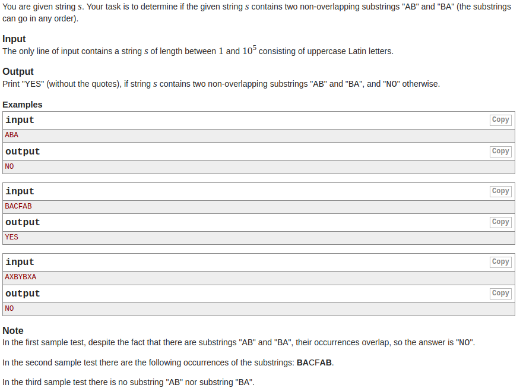

# AB<->BA SubStrings?

[](https://travis-ci.com/boivlad/ab-ba-string)
## How to test:
1. Clone this repository
2. `npm intsall`
3. `npm test`
## How to use:
1. Clone this repository
2. `npm intsall`
3. Example:
```javascript
const { subString } = require('../src/index');
subString("ABABA");
```
You take result `True` if the given string contains two non-overlapping substring "AB" and "BA" (the substrings can go in any order) and otherwise `False`.

